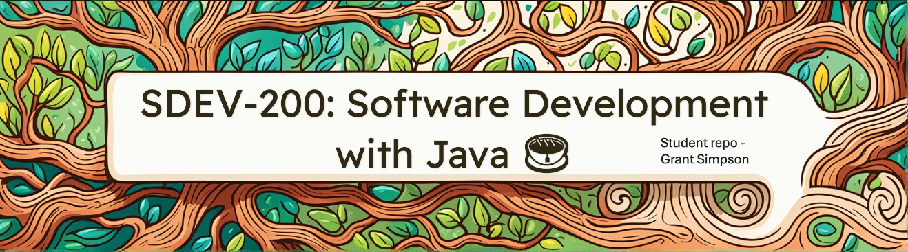

# SDEV-200 Software Development with Java

Full disclosure: I created this banner using Microsoft's Designer tool (generative AI). 

### Description:

Repository for my Java class programming assignments.

---

### Table of contents

[Module 01](M01)
- [P01 - LengthConverter](M01/P01_LengthConverter/src)
- [P02 - CreditCardValidator](M01/P02_CreditCardValidator/src)
- [P03 - IdenticalArrays](P03_IdenticalArrays/src)
- [P04 - RegularPolygon](M01/P04_RegularPolygonUML)
- [out -  compiled prorgams](M01/out/production)

[Module 02](M02)
- [P01 - MyDate](M02/src/P01_MyDate)
- [P02 - Triangle](M02/src/P02_Triangle)
- [P03 - BinaryFormatException](M02/src/P03_BinaryFormatException)
- [out - compiled programs](M02/out/production/M02)

[Module 03](M03)
- [P01 - ComparableCircle](M03/src/P01_ComparableCircle)
- [P02 - RationalBigInteger](M03/src/P02_RationalBigInteger)
- [out - compiled programs](M03/out/production)

[Module 04](M04)
- [P01 - BalancedBrackets](M04/src/P01_BalancedBrackets)
- [P02 - CountKeywordsV2](M04/src/P02_CountKeywordsV2)
- [P03 - LinkedList](M04/src/P03_LinkedList)
- [out - compiled programs](M04/out/production)

[Module 05 (CircleBW)](CircleBW/src/main/java/com/m05)  
- [P01 - GridPane](CircleBW/src/main/java/com/m05/GridPane)
- [P02 - circleBW](CircleBW/src/main/java/com/m05/circlebw)
- [P03 - TextColor](CircleBW/src/main/java/com/m05/TextColor)
- [out - compiled programs](out/production/M05)

> [!NOTE]
> The reason M05 is named CircleBW is due to a naming mishap.   I've tried to safely
> rename it but have run into some challenges.

[Module 06](M06/src/main/java/com/m06/p01_staffrecord)
